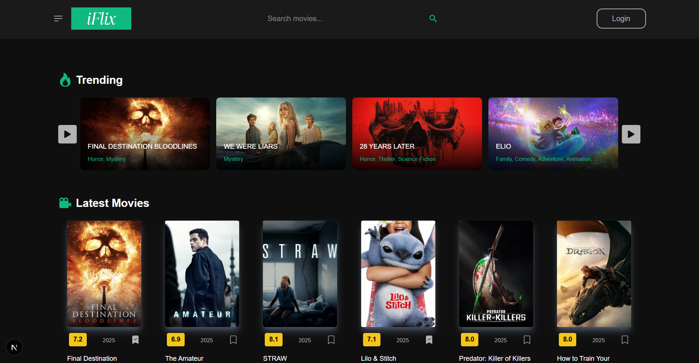
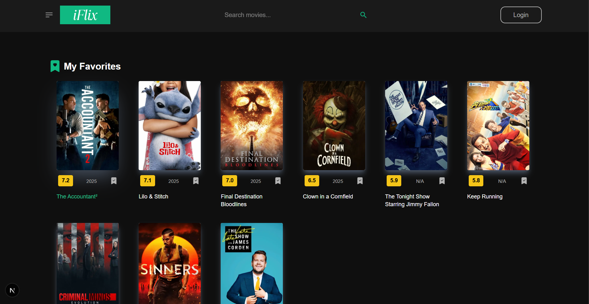
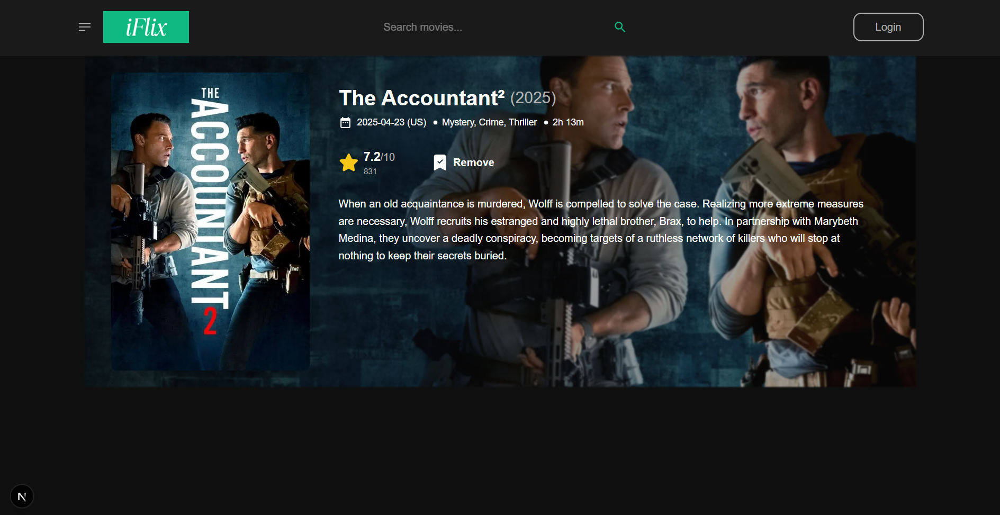

# 🎬 Movie Search & Favorites App

A mobile-responsive movie search and favorites application built using **Next.js**, **Tailwind CSS**, and **React Icons**. This project allows users to search for movies via the TMDB API, view search results, and manage a personal list of favorite movies stored locally in the browser.

---

## 🚀 Features

- 🔍 **Movie Search**  
  - Search for movies/tv shows by title using the TMDB API  
  - Display poster, title, and release year for each result  
  - Show a loading indicator while fetching data  
  - Graceful error handling (e.g., no results, network issues)

- ⭐ **Favorites Management**  
  - Add/remove movies from favorites  
  - View a separate list of favorited movies  
  - Persist favorites in `localStorage` across browser sessions  
  - Prevent duplicate entries in favorites list

- 🎛️ **Bonus (Optional Enhancements)**  
  - Toggle between search results and favorite list views  
  - Responsive layout and clean UI using Tailwind CSS  
  - Icons via React Icons for enhanced UX  

---

## 📦 Tech Stack

- **Framework**: [Next.js](https://nextjs.org/)  
- **Styling**: [Tailwind CSS](https://tailwindcss.com/)  
- **Icons**: [React Icons](https://react-icons.github.io/react-icons)  
- **API**: [TMDB API](https://www.themoviedb.org/documentation/api)  
- **Storage**: `localStorage` for client-side persistence  
- **State Management**: React Hooks (`useState`, `useEffect`,`useRef`,`useContext`)

---

## 🧩 Component Breakdown

- `SearchBar`: Handles input and submit for movie queries  
- `MovieList/TvList`: Displays list of movies/tv shows (search results or favorites)  
- `MovieCard`: Individual movie UI with add/remove favorite button  
- `FavoritesList`: Displays user's favorite movies  

---

## 📸 Screenshots

- `Home Page`

- `Favorites Page`

- `Movie Details`
